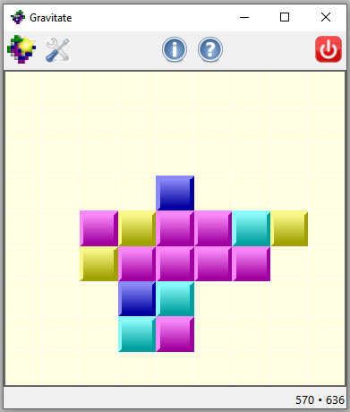

# Gravitate

A SameGame/TileFall-like game written in Tcl/Tk

**gravitate.exe is a precompiled Windows binary that will run on pretty well
any 32- or 64-bit version of Windows from XP to 10**

## Dependencies

Tcl, Tcllib, Tk, Tklib, all version 8.6 or better.

## License

GPL-3.0.

## Other Versions

For versions in C++/wxWidgets, D/GtkD, Nim/NiGui, Java/AWT/Swing,
Python/Tkinter, Python/wxPython, and JavaScript see
[www.qtrac.eu/gravitate.html](http://www.qtrac.eu/gravitate.html).
